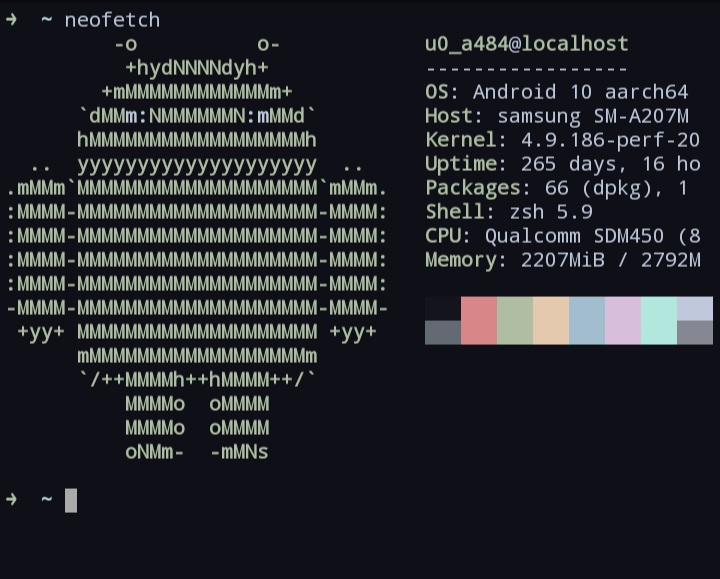

<div align="center">
    
    <h1>Levuaska for Termux</h1>
    <p></p>
    <a href="https://github.com/levuaska/termux/stargazers">
        
    </a>
    <a href="https://github.com/levuaska/termux/network/members/">
        
    <a href="https://github.com/levuaska/termux">
    	
    </a>
    <a href="https://github.com/levuaska/termux/blob/main/LICENSE">
    	
    </a>
</div>
<hr>
  <div align="center">
   </center>
</div>
    
<h2>🔎 Installation</h2>
  
- Using curl:
  ```
  curl -o ~/.termux/colors.properties https://raw.githubusercontent.com/levuaska/termux/main/colors.properties --create-dirs
  ```

- And restart app or use other session
  
<h2>💜 Thanks<h2>

- [justleoo](https://github.com/justleoo)
